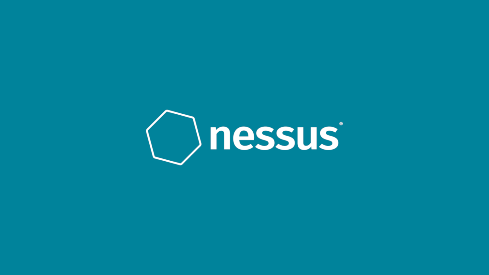

# Nessus | Vulnerability Management
### Learning objectives:
1. Provisioning and deprovisioning virtual environments within Microsoft Azure.
2. Run initial vulnerability scan using Nessus against vm and observe results.
3. Run a credentialed vulnerability scan and compare/contrast results.
4. Remediation

### Technologies and Protocols:
* Azure virtual machines
* Nessus Essentials 
* Firefox 3.6.12

> NOTE: This lab will be done on a Mac OS X host and a Windows VM for scanning.
 
### Overview:
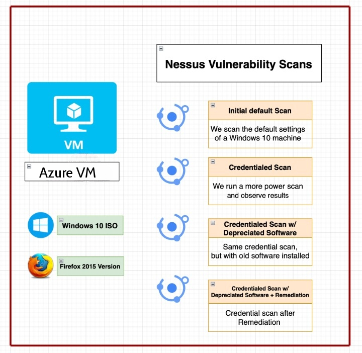

## Step 1.1: Signup and install [Nessus Essentials](https://www.tenable.com/products/nessus/nessus-essentials)
- Register for an account
- You will receive an activation code in your email
- Copy your activation code in your email and click the Download Nessus as well
- Choose Nessus > View Downloads 
- Under version chose Nessus - 8.15.6
- Under platform choose Windows - x86_64 **make sure it includes Server 2012 R2, 7,8,10**
- Open Tenable Nessus and click next and install
- After finishing installation and window should pop up with a local host URL 
- Copy/paste the URL for future use 

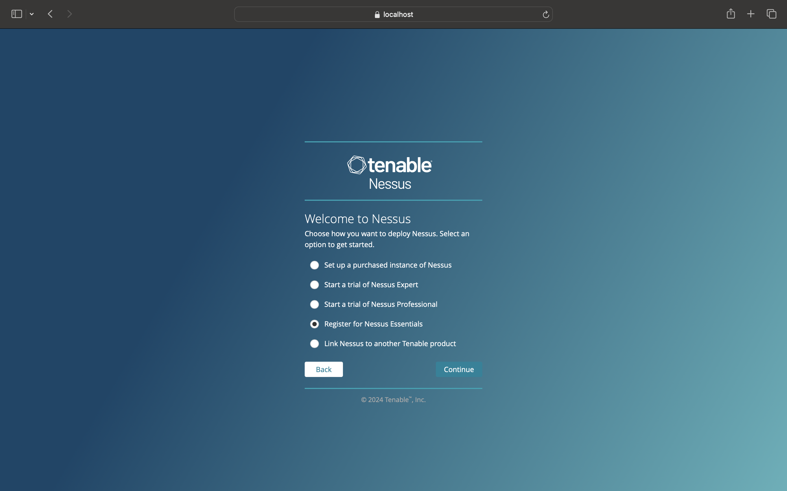
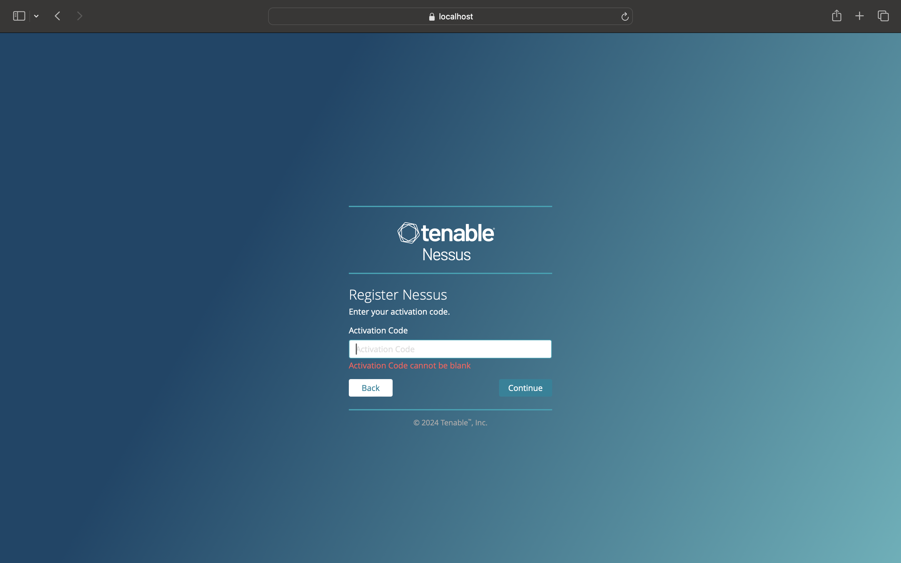
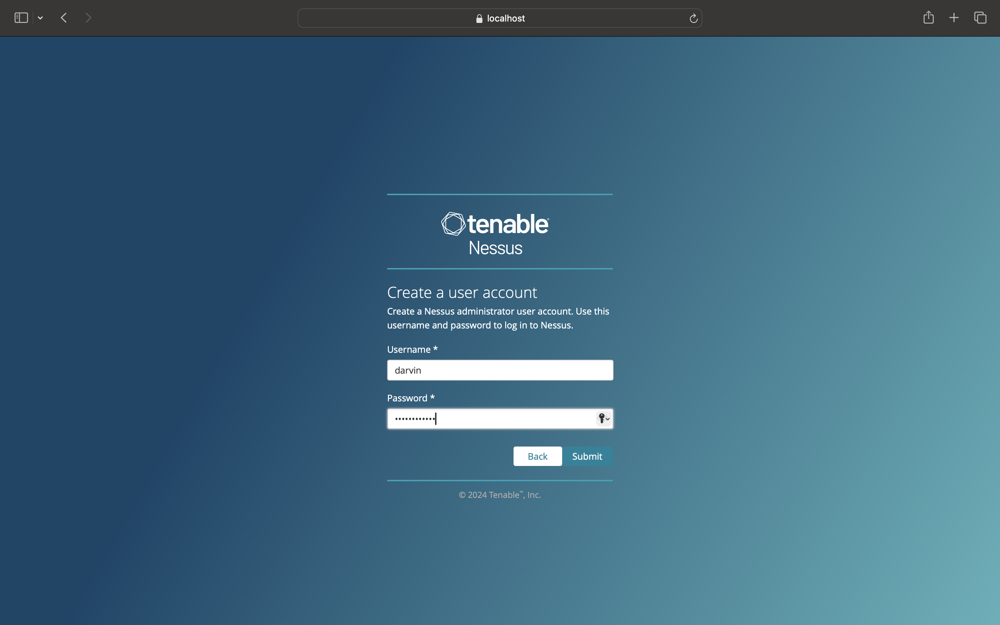

## Step 1.2: Finish Nessus installation 
- click Connect via SSL on web page 
- Click Advance on warning page > continue to localhost > Nessus Essentials 
- Click skip on Get an activation code (we already have ours)
- Paste activation code > continue 
- Create a username and password **remember for future use**
- Click submit > and wait for download 
- Let’s download the rest of our tools while we wait

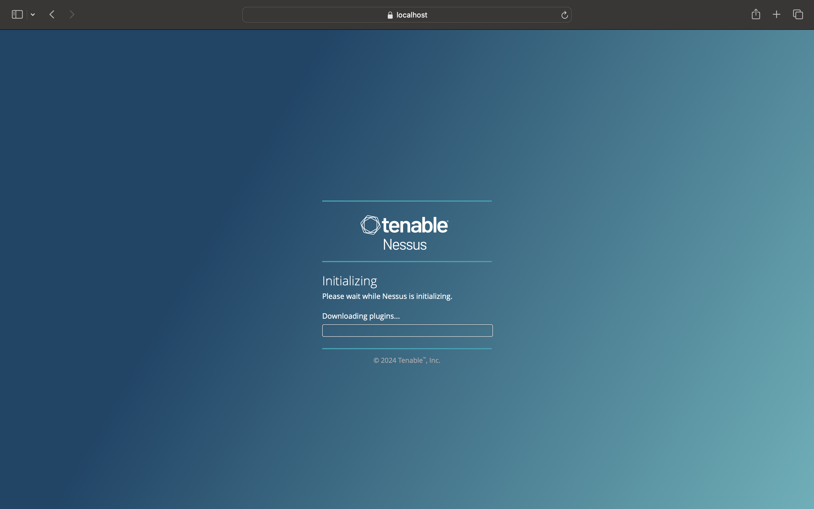

## Step 2: Create Azure VM
- Goto Virtual Machines and setup a VM
- Ensure RDP traffic is allowed to the VM
- Login to the VM using the downloaded RDP file once deployment is successful

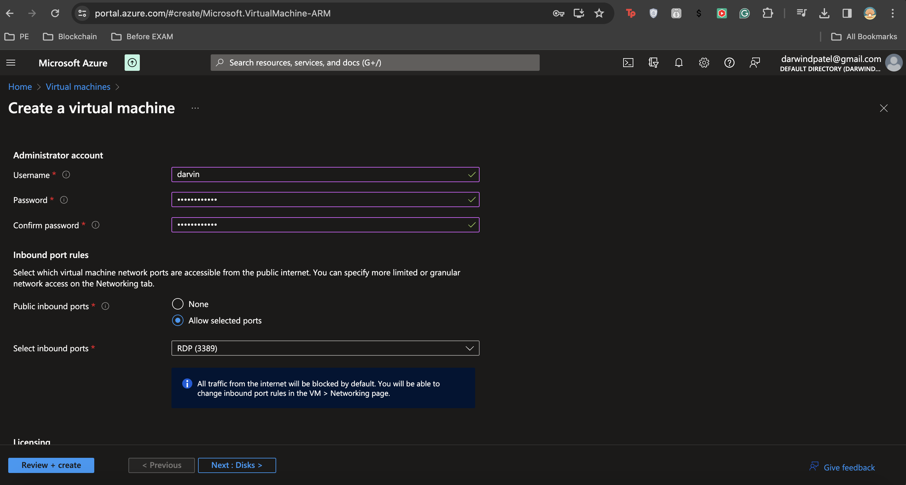
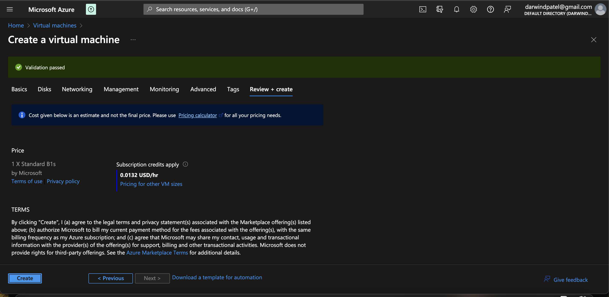
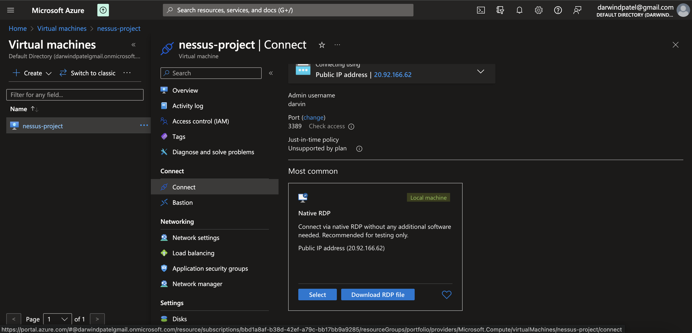
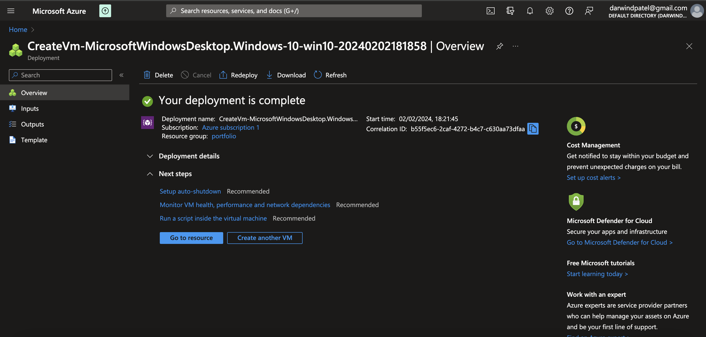
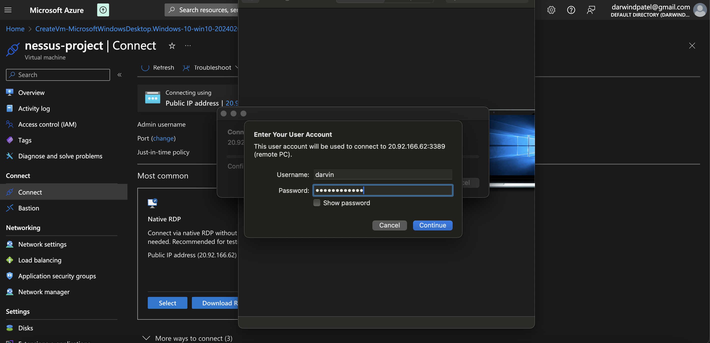
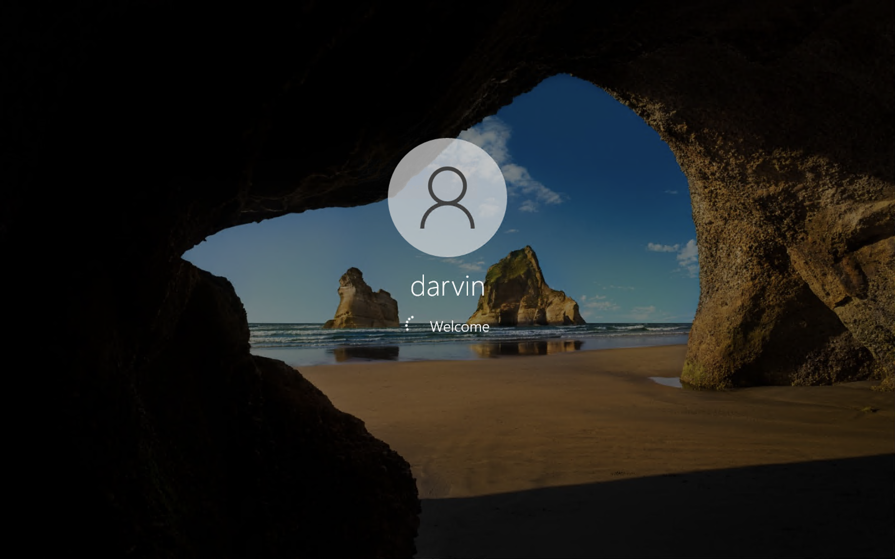

## Step 5.1: Configure vm
- let’s scan our vm to see if you get any response - later we’ll do a more powerful credential scan 
- From your host machine ping the VM using its public IP address to check communication
- If failed, then check notes

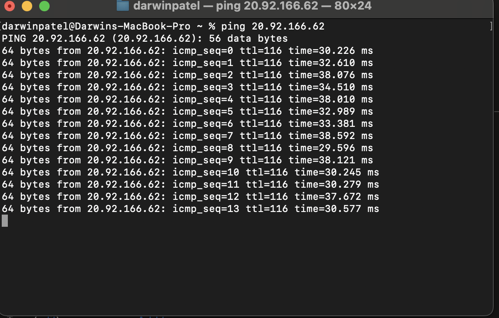

> Notes:
> in your vm search mf.msc > windows defender firewall properties 
> Under Domain profile tab, private profile tab and public profile tab turn the firewalls OFF.

> 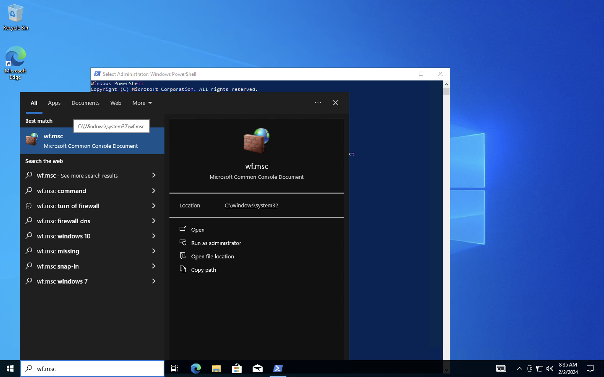
> 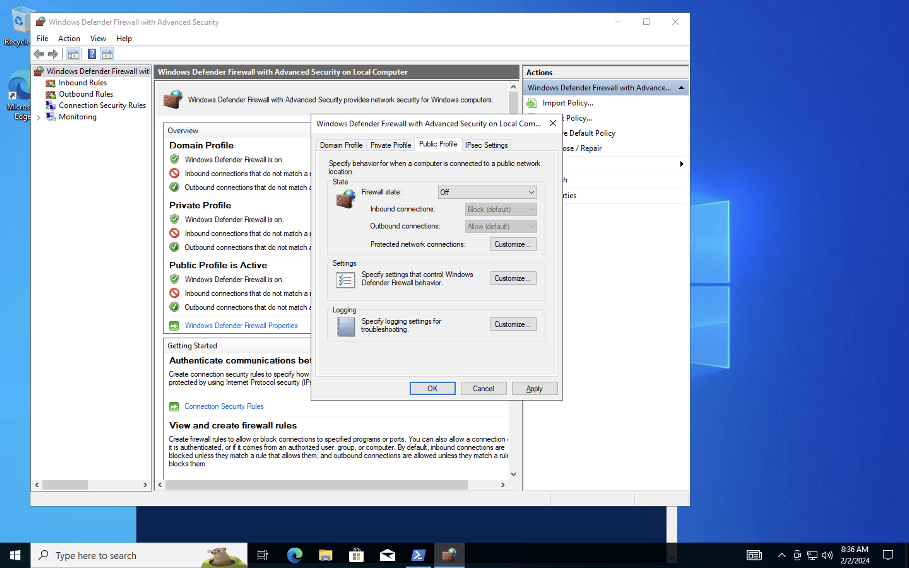

## Step 6: Basic Nessus Scan
- sign into Nessus Essentials and click Create a new scan 
- Under vulnerabilities choose Basic Network Scan
- Name it Windows 10 Single Host and paste the *vm* ip in the targets field. 
- Leave the rest of the setting alone 
- Hit save, you should see the scan we just configured on the next page 
- Scroll over and hit the play button …
- Give it a second to scan 

## Step 7: Basic scan results 
- If you click on the scan we can look at the details of the results. 
- Not much information is brought back but still some interesting fields.

- If we click vulnerabilities tab we see 1 medium sever vulnerability. 
- Most look like to be basic info vulnerabilities - just Nessus giving us a heads up. 

- when we click on the medium severity we find “SMB Signing not required”. 
- There’s a description and solution as well. Neat. 
- Next let’s configure our vm for a stronger, credentialed scan

## Step 8.1: Configuring vm to allow a credentialed scan
- On your vm, search services. 
- Find and click Remote Registry > under Startup type choose Automatic > click Apply > start
- This will allow Nessus to **crawl** through our vm registry and allow a scan. 

## Step 8.2: Change User Account Control Settings
- Search user account control 
- Change the setting to Never Notify 

> NOTE: these setting are not recommended in any other context. These are just for demo and lab purposes. 

## Step 8.3: Add a Registar key to further connectivity into the Registry. 
- search Registry Editor 
- Choose LOCAL_MACHINE > SOFTWARE > Microsoft > Windows > Current version > Policies > System 
- Under system right-click and crest a new DWORD Value
- Name it `LocalAccountTokenFilterPolicy`
- Double-click it and set the value to 1 
- Restart your vm

## Step 9.1: Configure a credential scan on Nessus 
- back on Nessus, select our original scan and click more at the top > configure 
- Under the Credentials tab > windows 
- Make sure Password is selected and put your username and password from the vm here. 
- Go back to My Scans and hit play button to run …

## Step 9.2: NEW credentialed scanned 
- after clicking our NEW scan you can already notice a significant difference!
- Our basic scan returned to us 1 medium vulnerability, but our credentialed scanned returned 2 critical, 9 high, 19 medium and 1 low vulnerability. Wow!
- If you click into the History tab you can compare the pie chart of our two scans.

> this highlights the importance of running a credentialed scan

## Step 9.3: Potential quick Remediations 
- if we take a look at the Remediations tab we find two actions Nessus recommends to take. 
- These are high level recommendations that would remediate most of our specific vulnerabilities. 
- So instead of running a fine-tooth comb we can potentially take these 2 actions to cover most vulnerabilities - and it looks like a couple of quick updates/patching would do the trick. 
- Something to think about for those vulnerability managers in the future.  

> patching / updating these systems would fix a lot of our vulnerabilities. 

## Step 10: Let’s add some depreciated software to SPICE up another scan
- We can download an old version of Firefox [here](https://ftp.mozilla.org/pub/firefox/releases/3.6.12/win32/en-US/)
- NOTE: download this onto your vm
- Download the first 3.6.12.exe file you see. 
- Install Firefox 3.6.12 (2015 version) on your vm as seen here:

## Step 11: Launch another scan 
- Back on our Nessus go to My Scans > and launch the same scan - this time we don’t need to make any new reconfigurations. 
- Give it some time …

## Step 12: Scan results after installing depreciated Firefox 
- Let’s compare our three scans now. 
- First our default out-of-the-box scan:

- Next our more robust, credentialed scan:

- And finally, our credentialed scanned with an old version of Firefox:

> what a world of difference! - our initial credentialed scan returned 1% critical vulnerabilities, but our scan with the OLD Firefox returned 13% in critical vulnerabilities. 

KEY TAKE AWAY: with the inclusion of depreciated software we saw a 13x jump in critical vulnerabilities. An easy fix to these vulnerabilities would be to simply uninstall the software. Again, this is why it is so important to keep your software and systems patched and updated in the real world. 

## Step 13: System Remediations through updates and patching
- Back on our vm - search and run `appwiz.cpl`
- Choose Firefox 3.6.12 and click uninstall 
- Go back to search > windows update > and check for updates 
- Click Install now for any updates …
- After installing updates and restarting your vm, check again for updates. 
- After installing any new updates, restart and we should be good!

## Step 14: Run final scan and compare 
- Back on Nessus, run our scan one final time. 
- We should see a bunch of remediations after the scan is complete. 
- Let’s compare our initial credential scan to our most recent scan in the history tab - these two are the most consistent. 
- Our initial, default credential scan:

> This scan returned to us 6% high and 14% medium vulnerabilities. 

- Our remediated credential scan: 

> In comparison, our final scan returned only 2% high and 10% medium vulnerabilities. 

- Simply updating Windows remediated more than half of our high vulnerabilities.

## Final Step: Further Possible remediations
- take a look at the Vulnerabilities tab 
- Internet explorer still has some high/mixed vulnerabilities. 
- What else can we do to take care of these vulnerabilities? Possibly more updates …

